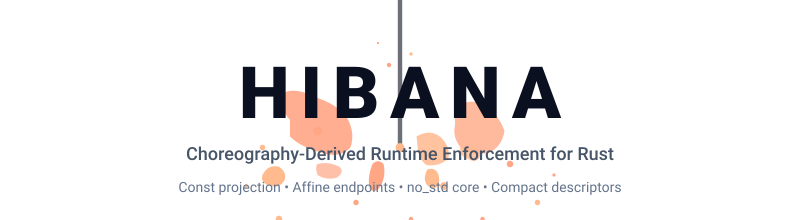

<div align="center">
  

  <p>
    <a href="https://github.com/hibanaworks/hibana/actions/workflows/quality-gates.yml"></a>
    <a href="https://crates.io/crates/hibana"></a>
    <a href="https://docs.rs/hibana"></a>
    <a href="LICENSE-APACHE"></a>
  </p>
</div>

# Hibana

Hibana lets Rust programs execute a finite multiparty protocol from one global
choreography. The choreography is projected into a compact program for each
role, and every send, receive, or route step must match that program before
progress commits.

Hibana is a **choreography-derived runtime enforcement kernel**. It is
unconditionally `no_std`, needs no allocator, and uses caller-provided storage.
Protocol state is kept in compact descriptors instead of a distinct Rust
continuation type for every state, so protocol growth does not become endpoint
type growth.

- one choreography for up to 256 roles using the complete one-byte role domain;
- asynchronous `send`, `seq`, `par`, binary `route`, and guarded `roll`;
- affine endpoints that may be dropped but cannot publish progress twice;
- transport-neutral integration through one `Transport` trait;
- the same public API on hosted and embedded targets.

Role IDs cover `0..=255`. Projection, route participation, and attachment
accounting derive storage from actual events and local participants; the runtime
does not reserve a 256-entry role table. Splitting a protocol across several
sessions still changes the guarantee boundary: Hibana checks each session, not
the original choreography as one global protocol.

Hibana does not implement a network stack or a distributed algorithm. It
enforces the protocol at each attached endpoint and states the carrier,
deployment, codec, and scheduling conditions needed to lift that local result
to a distributed guarantee.

This README is arranged by responsibility:

| Reader | Start here | You will find |
| --- | --- | --- |
| Evaluating Hibana | [Model](#model) | What it enforces, what remains external, and why endpoint types stay small |
| Writing a choreography | [Protocol Language](#protocol-language) | Projection, messages, routes, parallel flows, and repetition |
| Implementing a role | [Endpoint Operations](#endpoint-operations) | `send`, `recv`, `offer`, branch handling, and failure behavior |
| Integrating a protocol | [Runtime Boundary](#runtime-boundary) | Storage, attach, sessions, resolvers, and observation |
| Implementing a carrier | [Transport](#transport) | The complete five-operation contract and delivery premises |
| Auditing a deployment | [Guarantees](#guarantees) | Local guarantees, conditional distributed guarantees, resource use, and verification |

## Quick Start

Add the crate:

```bash
cargo add hibana
```

The crate uses Rust 2024 and requires stable Rust `1.95` or newer. It has no
normal dependencies and no feature-selected hosted variant.

Run the complete two-role example from a repository checkout:

```bash
cargo run --example ping_pong
```

```text
ping=7, pong=8
```

The example is self-checking, ships in the published package, and is executed
by the release gate. Read the complete source in
[`examples/ping_pong.rs`](examples/ping_pong.rs). Its protocol is small enough
to see in one place:

```rust
use hibana::{
    g::{self, Msg},
    runtime::program::{RoleProgram, project},
};

fn ping_pong() -> (RoleProgram<0>, RoleProgram<1>) {
    let choreography = g::seq(
        g::send::<0, 1, Msg<1, u32>>(),
        g::send::<1, 0, Msg<2, u32>>(),
    );

    (project(&choreography), project(&choreography))
}
```

The executable example adds caller-owned runtime storage and an in-memory host
transport, attaches both role programs to one `SessionId`, and drives the two
endpoints with `send()` and `recv()`. An embedded deployment supplies its own
transport, storage budget, and executor; the choreography and endpoint
operations stay the same.

## Model

```text
global choreography
  -> project(&choreography) once per role
  -> compact RoleProgram descriptors
  -> attach each role to one SessionId
  -> drive Endpoint::send / recv / offer
  -> commit exactly one permitted step or fail the session generation
```

**Multiparty** means peer, direction, and order come from one choreography
projected for every role. **Asynchronous** means a successful send transfers a
frame to the carrier; it does not wait for the remote receive. **Affine** means
one live endpoint owner can advance a projected step at most once. The endpoint
may be dropped, but it cannot be cloned or used to publish duplicate progress.

Hibana has two public surfaces:

| Audience | Surface | Responsibility |
| --- | --- | --- |
| Role implementation | `hibana::g`, `Endpoint`, `RouteBranch`, `EndpointError` | Describe messages and drive one attached role |
| Protocol integration | `hibana::runtime` | Project roles, provide storage and transport, attach sessions, and install explicit resolvers |

Application code normally stays on `hibana::g` and `Endpoint`. Protocol
integration code uses `hibana::runtime`; it does not expose carrier state or
descriptor machinery to role code. [docs.rs](https://docs.rs/hibana) is the
signature reference for the same surface described here.

The temporary choreography value carries its structure in Rust while
`project(&choreography)` builds a compact `RoleProgram<ROLE>`. Endpoint futures
do not carry the choreography tree or every future payload type. Reusing one
projected artifact for many isolated sessions therefore does not multiply
endpoint types. Projection lowers the existing public DSL in one internal pass;
its flat event rows, scope markers, resolver markers, and allocation scratch do
not enter the endpoint, descriptor header, or Pico runtime state.

## Protocol Language

| Form | Meaning |
| --- | --- |
| `g::send::<FROM, TO, g::Msg<LABEL, PAYLOAD>>()` | One visible asynchronous message |
| `g::seq(left, right)` | `left` precedes `right` |
| `g::par(left, right)` | Independent arms may progress concurrently |
| `g::route(left, right)` | One of two protocol arms |
| `route.resolve::<ID>()` | An explicit resolver owns a non-message choice |
| `body.roll()` | A guarded structural region may re-enter |

Projection rejects unsupported route shapes, ambiguous simultaneous endpoint
operations, conflicting parallel lanes, empty parallel arms, and unguarded
re-entry. Logical message labels identify choreography messages; they need not
be globally unique. A same-role `send` is a zero-byte local effect and must use
`()`. It does not hide payload data in a private queue.

Repeated regions add no iteration field to endpoint types, descriptor rows, or
the eight-byte core frame header. Freshness comes from the projected execution
rules plus carrier FIFO, replay exclusion, and generation isolation, not from
growing every frame or endpoint.

The compact descriptor domains impose these explicit limits:

| Domain | Limit | Meaning |
| --- | ---: | --- |
| Roles | 256 | The complete `u8` role domain, `0..=255` |
| Event identities | 65,535 | Dense identity domain; `u16::MAX` remains the absent sentinel |
| Program image | 65,535 B | Compact `u16` byte-offset domain for one immutable global image |
| Atom-only program | 7,281 events | `65,535 / 9`; control columns reduce this shape-dependent ceiling |
| Role image | 65,535 B per role | Compact `u16` byte-offset domain for one projected role image |
| Structured scopes | Image-derived | Every scope contributes at least two five-byte markers, so the byte ceiling binds before the compact scope-id domain |
| Route commit chain | Image-derived | A `u16` descriptor range; no separate `u8` chain ceiling |
| Resolver identities | 65,536 | The complete `u16` domain; intrinsic/dynamic authority is tagged separately in the route row |
| Physical lanes | 256 | Storage follows the exact projected lane span; lanes are reused when endpoint-role sets do not conflict and no hidden binding lanes are reserved |
| Offer frontier | Descriptor-derived | Active-key storage follows active lanes; restart-spanning visited identities follow the finite local-step domain |
| Inbound frame colors | 256 | Maximum simultaneously competing receive candidates for one source/receiver/lane key |

Frame colors are not cumulative message numbers. More than 256 ordered
messages may reuse a color; distinct sources may also reuse a color because the
runtime compares source, lane, and frame color together. Inside `.roll`, equal
route paths reuse one color while distinct paths of the same inbound key receive
distinct colors for elastic re-entry. Projection rejects only a frontier that
genuinely requires a 257th color for one complete inbound key. Routes remain
binary by design.
The event-identity domain is not a promise that every 65,535-event source fits
one image. A protocol is accepted only when both its global image and every
projected role image fit their byte domains; the exact event ceiling therefore
depends on its messages, scopes, dependencies, route evidence, and role views.
The internal scope-id domain contains 8,192 identities, but this is not an
additional acceptance limit: even the smallest structured scope consumes ten
program-image bytes, so a fitting image contains at most 6,553 scopes. Route
commit-chain lengths use the same compact `u16` count domain and are therefore
bounded by descriptor structure rather than by an unrelated 255-entry runtime
field. Runtime route history is a packed sparse table sized by emitted
`(lane, route)` relations, not by `active lanes × maximum route depth`.
The temporary source is still a Rust type tree, but lowering stores events,
normalized closed scope markers, and resolver markers in one exact-count tagged
arena. Scope publication is atomic, and primary markers carry the proof-only arm
boundaries needed by later passes; that metadata is erased from the descriptor.
Production const capacity validation ties source counts to the exact final
column counts and byte length, Kani checks the packed count domain, and Lean
proves generally that the exact descriptor bytes dominate the source-row count.
Row contents remain the separate responsibility of translation validation. The
temporary arena therefore has no smaller independent acceptance ceiling. Its
lane matching scratch is bounded by the 256-value wire lane domain rather than
by event count.
A const fixture constructs and emits the full 7,281-event
atom-only image. Public typed fixtures separately track 289 messages and 258
parallel events under rustc's default recursion limit. A Pico-target compile
gate projects 256 linear cyclic sender handoffs, 64 handoffs per route arm, and
a 64-event rolled cycle while bounding compiler time and memory for each causal
validation path. Large generated type trees should compose balanced subtrees;
genuinely nested source semantics deeper than that compiler limit may require a
crate-level `recursion_limit`. The dedicated `>128` scope test keeps this source
constraint separate from runtime, descriptor, stack, and SRAM measurements.

Receive-lane sender changes use structured causal must analysis. A route joins
only facts established in every possible arm; parallel arms start from the
same incoming facts and cannot relay each other's intermediate results. A
rolled body composes fresh visits with independent route choices. The exact
256-role fact set occupies 32 bytes of compiler scratch and adds no endpoint,
wire, or runtime state. The Lean model proves must facts for every selected-arm
execution and derives receive-before-send order under its explicit schedule
premises. Generated kernel checks compare concrete Rust and Lean decisions;
they are finite correspondence evidence, not a universal Rust refinement.

Role projection computes immutable source-to-parent scope facts once and shares
those compiler facts across roles. The exact kind/ordinal domain is erased from
the final descriptor. Route validation checks global authority once per scope
and retains every role's observer checks. Parallel dependency compilation saves
the shared sequential prefix at each fork, restores it at the split, and applies
the whole local join after both arms. Both arms require that prefix even when
the right arm introduces a new lane; neither arm acquires a dependency on its
sibling's intermediate events. Shared-offset boundaries finish joins, restore splits,
then record new inputs; serialized marker tie order is preserved. Initial offer
dispatch follows the observed lane head when another arm has moved the shared
cursor. Lean proves the sibling exclusion, retained sequential join, saved fork
input, and lane-head preservation properties. Ten additional exact Rust/Lean
descriptor fixtures and their corruption rejections are kernel-checked; these
remain finite correspondence evidence rather than a universal Rust proof.

### Messages And Payloads

`g::Msg<L, P>` names logical label `L` and wire payload `P`. Built-in exact
codecs cover `()`, `bool`, signed and unsigned integers, byte slices, and fixed
byte arrays. Fixed-width decoders reject trailing bytes. Received slices may
borrow from the carrier-owned frame for the endpoint borrow.

Custom payloads implement both contracts:

- `WireEncode::encode_into` writes deterministic bytes and reports their
  length;
- `WirePayload::validate_payload` accepts the exact canonical byte shape before
  endpoint progress commits;
- `WirePayload::decode_validated_payload` decodes bytes already validated;
- `WirePayload::SCHEMA_ID` names that canonical wire contract in the
  descriptor.

The schema id is not a cross-binary Rust nominal type id and is not sent in the
core frame header. Incompatible encodings or validation rules require distinct
ids. Different Rust wrappers may share an id only when they deliberately
implement the same canonical bytes and validation. Schema `0` belongs to the
exact zero-byte unit schema.

This complete custom fixed-width codec illustrates the contract:

```rust
use hibana::runtime::wire::{CodecError, Payload, WireEncode, WirePayload};

struct FourBytes([u8; 4]);

impl WireEncode for FourBytes {
    fn encode_into(&self, out: &mut [u8]) -> Result<usize, CodecError> {
        if out.len() < 4 {
            return Err(CodecError::Truncated);
        }
        out[..4].copy_from_slice(&self.0);
        Ok(4)
    }
}

impl WirePayload for FourBytes {
    const SCHEMA_ID: u32 = 0x4000_0000;

    type Decoded<'a> = FourBytes;

    fn validate_payload(input: Payload<'_>) -> Result<(), CodecError> {
        if input.as_bytes().len() == 4 {
            Ok(())
        } else {
            Err(CodecError::Malformed)
        }
    }

    fn decode_validated_payload(input: Payload<'_>) -> Self::Decoded<'_> {
        let bytes = input.as_bytes();
        FourBytes([bytes[0], bytes[1], bytes[2], bytes[3]])
    }
}
```

Codec correctness remains the codec implementor's responsibility. Hibana
checks that each operation uses the schema id projected for that event and that
the decoder accepts the received bytes before committing progress.

### Endpoint Operations

The role API is deliberately small:

| Operation | Result and commit rule |
| --- | --- |
| `Endpoint::send::<M>(&payload)` | Commits after the descriptor accepts `M` and the carrier accepts the frame |
| `Endpoint::recv::<M>()` | Returns `M::Payload::Decoded` after carrier evidence, `M`, and its payload all match |
| `Endpoint::offer()` | Returns a `RouteBranch` preview without committing by itself |
| `RouteBranch::label()` | Reports the selected arm's first logical message label |
| `RouteBranch::send` / `recv` | Consumes the preview and commits the selected arm's first visible step |

Inside an async role function, ordinary message flow is direct:

```rust
use hibana::{Endpoint, EndpointError, g::Msg};

async fn client(endpoint: &mut Endpoint<'_, 0>) -> Result<u16, EndpointError> {
    let request = [1, 2, 3, 4];
    endpoint.send::<Msg<10, [u8; 4]>>(&request).await?;
    endpoint.recv::<Msg<11, u16>>().await
}
```

Endpoint progress happens when `send()`, `recv()`, or a route branch first-step
operation succeeds. Dropping an unpolled send publishes no progress. A dropped
route preview, rejected operation, or successful `requeue(...)` consumes no
protocol step.

### Route Choice

Prefer in-band choice: make the message that selects a branch its first visible
action. `RouteBranch::label()` then reports that selected arm's first logical
message label, and the first send or receive is performed through the branch.
Payload contents, queue position, and carrier observations are never branch
authority.

For example, this route is selected by the first message visible to role `1`:

```rust
use hibana::g;

let accepted = g::send::<0, 1, g::Msg<31, u32>>();
let rejected = g::send::<0, 1, g::Msg<33, ()>>();
let routed = g::route(accepted, rejected);
```

The receiving role previews, inspects, and consumes that selected first step:

```rust
use hibana::{Endpoint, EndpointError, g::Msg};

async fn receive_choice(
    endpoint: &mut Endpoint<'_, 1>,
) -> Result<Option<u32>, EndpointError> {
    let branch = endpoint.offer().await?;
    match branch.label() {
        31 => Ok(Some(branch.recv::<Msg<31, u32>>().await?)),
        33 => {
            branch.recv::<Msg<33, ()>>().await?;
            Ok(None)
        }
        label => panic!("unexpected route label {label}"),
    }
}
```

When a timer, readiness signal, budget, or another non-message signal owns the
choice, mark the route with `.resolve::<ID>()` and install a typed
`ResolverRef::<ID>::decision_state(...)`. Resolver failure rejects the step; it
does not select another arm. Resolver state is local input, so roles that act
before receiving in-band branch evidence need deployment-level agreement on
the decision.

### Parallel And Repeated Regions

`g::par(left, right)` combines independent flows. Projection assigns logical
lanes and rejects simultaneous local operations that cannot be selected
exactly. The arms are not threads and do not choose an executor; they describe
protocol independence that the attached roles may drive concurrently.

```rust
use hibana::g;

let left = g::send::<0, 1, g::Msg<50, u32>>();
let right = g::send::<2, 3, g::Msg<50, u32>>();
let independent = g::par(left, right);
```

`.roll()` marks a guarded structural region that may re-enter. For an explicit
route resolver, resolve the route first and roll the surrounding region second:

```rust
use hibana::g;

const ROUTE_DECISION: u16 = 7;

let repeated = g::route(
    g::send::<0, 1, g::Msg<40, u32>>(),
    g::send::<0, 1, g::Msg<41, ()>>(),
)
    .resolve::<ROUTE_DECISION>()
    .roll();
```

The reverse call order is unavailable because `resolve::<ID>()` belongs to a
route value, not to the rolled result. Nested repeated regions follow the same
rule. An intentional infinite repeated region is valid protocol behavior, so
Hibana does not claim that every session terminates.

## Runtime Boundary

The runtime borrows one caller-provided byte region and derives its internal
layout from the projected descriptors. `SessionKitStorage::uninit().init()` is
the single construction path. `SessionKit::rendezvous(...)` binds the storage
region and one transport. `RendezvousKit::enter(...)` attaches a projected role
to a session.

`SessionKit` and its endpoints belong to one local runtime owner; they are not
shared concurrent handles. Interrupts, worker threads, and device callbacks
communicate through transport-owned state and wake the executor through stored
wakers. The executor itself is integration-owned.

The runnable example uses this complete construction sequence after projection:

```rust
use hibana::runtime::{SessionKitStorage, ids::SessionId};

let mut slab = [0_u8; 3 * 1024];
let mut storage = SessionKitStorage::<InMemoryTransport>::uninit();
let kit = storage.init();
let rendezvous = kit
    .rendezvous(&mut slab, InMemoryTransport::new())
    .expect("create rendezvous");
let session = SessionId::new(1);
let client = rendezvous
    .enter(session, &client_program)
    .expect("attach client");
let server = rendezvous
    .enter(session, &server_program)
    .expect("attach server");
```

`InMemoryTransport`, `client_program`, and `server_program` are defined by the
runnable example. A deployment replaces only the transport and measured slab
budget. `SessionKitStorage`, the choreography, projection, attach sequence, and
endpoint API are unchanged. An undersized slab produces `AttachError`; Hibana
does not substitute a smaller layout or hidden allocation.

The first local attach binds a session generation to one exact compiled
program image. A byte-different image or a second live attach for the same
`(rendezvous, SessionId, role)` is rejected. Dropping an endpoint releases its
lease. Resolver-dependent local roles must be attached before first resolver
execution seals local membership.

| Boundary | Hibana owns | Integration owns |
| --- | --- | --- |
| Choreography | Projection and exact local descriptor admission | Distributing the accepted role images |
| Endpoint | Affine, fail-closed progress | Driving enabled operations fairly |
| Payload | Schema identity and validation at the endpoint | Correct canonical codec implementations |
| Carrier | Framed header checks; unique lane/label/schema interpretation for headerless ingress; exact descriptor event admission in both cases | Peer binding, FIFO delivery, replay exclusion, generation isolation, and closure notification |
| Security | No hidden security claim | Authentication, cryptography, admission control, and failure detection |

### Transport

`Transport` owns byte buffers, framing, readiness, ingress demultiplexing, and
wakeups. Hibana owns choreography meaning and route authority. Transport
implementations provide two associated handle types and five operations:

| Operation | Required behavior |
| --- | --- |
| `open(PortOpen)` | Create Tx/Rx handles bound to the descriptor-derived local role, `SessionId`, and lane |
| `poll_send(tx, Outgoing, cx)` | Progress one frame; `Ready(Ok(()))` transfers it to carrier ownership, while `Pending` retains no payload pointer |
| `cancel_send(tx)` | Remove transport-owned state for a dropped pending send, or retire the logical direction if bytes are already irrevocable |
| `poll_recv(rx, cx)` | Return one borrowed `ReceivedFrame` and store the current waker whenever the operation parks |
| `requeue(rx)` | Make the most recently returned frame observable again on the same handle after a zero-commit rejection |

`PortOpen` exposes `local_role()`, `session_id()`, and `lane()`. `Outgoing`
exposes `frame_label()`, `target_role()`, `lane()`, and `payload()`. The handles
returned by `open` may borrow buffers, device state, DMA records, and wakers
from the transport owner, so no allocation or transport-specific future type
enters Hibana's endpoint API.

After `poll_send` returns `Pending`, a later poll supplies the same encoded
content again, but its scratch address may differ. The transport may retain its
own progress in `Tx`; it must not retain the prior `Payload` pointer.

Receive evidence has two explicit construction paths:

```rust
use hibana::runtime::{
    transport::{FrameHeader, ReceivedFrame},
    wire::Payload,
};

let direct = ReceivedFrame::deterministic(Payload::new(payload_bytes));
let framed = ReceivedFrame::framed(
    FrameHeader::from_bytes(header_bytes),
    Payload::new(payload_bytes),
);
```

`ReceivedFrame::deterministic(...)` is valid only when direct `recv()` has one
live descriptor, or after `RouteBranch::recv()` already owns one materialized
receive descriptor. Route offer and unresolved route demultiplexing require
`ReceivedFrame::framed(...)` evidence. The core header is exactly eight
carrier-owned bytes:

```text
session id (4 bytes, big endian) | lane | source role | target role | frame label
```

The transport stores the `PortOpen` facts needed to build or validate that
framing. A framed receive is checked against the endpoint's exact session, lane,
source, target, frame label, descriptor event, logical label, and schema before
progress commits. A deterministic receive does not claim to observe source,
target, or frame label: its lane-bound Rx handle plus the requested logical label
and schema must identify exactly one enabled descriptor receive. Zero or multiple
matches fail closed. Peer authenticity and affine delivery remain carrier-profile
premises in both cases; reordering, repetition, and mismatch are not repaired
into ordinary progress.

A successful `poll_send` proves carrier acceptance, not remote receipt. To lift
local enforcement to global fidelity and progress, a concrete carrier must
also provide:

- expected peer and direction binding;
- FIFO delivery within each mapped logical direction;
- no unsolicited replay and no frame leakage across carrier generations;
- exactly one observation for each delivered frame;
- eventual delivery of accepted frames or observable terminal closure;
- receiver wakeup after accepted frames drain or are quarantined on closure.

Fresh transport-instance state is a sufficient carrier generation. Address or
path changes may remain inside one generation. Reusing a `SessionId` after
retirement requires carrier state that cannot expose a frame from the retired
generation. A multiplexed carrier may retire one logical direction while
unrelated sessions remain live.

Route agreement also requires every controller to execute its accepted image
through its Endpoint. Passive endpoints cannot detect a controller that bypasses
the kernel and fabricates opposite-arm frames for different peers. Peer
authentication alone does not make such a controller conforming. Hibana does
not implement Byzantine agreement between independent passive endpoints; the
carrier must preserve provenance from the conforming sender execution.

Protocol-invisible liveness detection belongs to the transport. A wait that
cannot progress returns `TransportError` from `poll_send` or `poll_recv`; it
does not create a hidden timeout branch. Returning `Pending` forever after
known peer closure does not satisfy the closing contract.

Hibana does not require an in-band protocol-image handshake. A deployment may
establish exact role-image agreement through its build artifact, authenticated
manifest, or an application protocol. This keeps bootstrap policy out of the
core and permits carriers with different framing requirements.

The [Unix datagram carrier](https://github.com/hibanaworks/hibana/tree/main/proofs/unix-carrier)
is an executable conformance example for peer binding, FIFO delivery, replay
exclusion, closure wakeup, and generation isolation. It demonstrates that the
contract is realizable; it is not a mandatory dependency or universal proof of
third-party transports.

### External Route Resolvers

An explicit resolver connects a non-message decision owner to a route marked
with `.resolve::<ID>()`. The id is checked against the projected role program,
and the state reference lives for the runtime configuration lifetime.

```rust
use hibana::runtime::resolver::{DecisionArm, ResolverError, ResolverRef};

const ROUTE_RESOLVER: u16 = 7;

struct RouteState {
    accept: bool,
}

fn decide_route(state: &RouteState) -> Result<DecisionArm, ResolverError> {
    if state.accept {
        Ok(DecisionArm::Left)
    } else {
        Ok(DecisionArm::Right)
    }
}

let state = RouteState { accept: true };
let resolver = ResolverRef::<ROUTE_RESOLVER>::decision_state(&state, decide_route);
rendezvous.set_resolver(&role_program, resolver)?;
```

Register against the exact `RoleProgram` that contains the resolver site.
`ResolverRef::decide()` permits typed resolver owners to compose other typed
resolver owners without exposing erased storage. Resolver rejection is
terminal evidence for that attempted endpoint step and never grants alternate
route authority.

A resolver registered in one rendezvous does not establish agreement with a
remote device. If several roles act before receiving an in-band indication,
the deployment or application protocol must supply the same decision to those
resolver owners.

### Sessions, Reconfiguration, And Observation

A projected descriptor is a finite session template, not a singleton runtime
instance. Distinct `SessionId` values have independent cursors, queues, leases,
and failure domains. Resolver registrations belong to the exact role program
within one rendezvous and may deliberately read application state shared across
sessions. Retrying an interaction or changing the finite participant set
creates a fresh session; changing the choreography also creates a fresh
projected artifact.

Persistent application data, membership policy, scheduling, restart policy,
and algorithm invariants remain application-owned. Larger systems may compose
explicit families of finite sessions, but each session keeps its own protocol
guarantee. This is an application architecture, not an equivalent encoding of
one global choreography across those sessions.

`RendezvousKit::tap()` returns a read-only iterator over the latest 21 public
16-byte evidence values. The ring stores 12-byte records and rebuilds their
monotonic timestamps while reading, so its 252-byte storage stays within the
256-byte budget. Events cover endpoint operations, carrier observations,
faults, lanes, route selection, and resolver decisions. Public code may read
records but cannot construct or push them. Tap is diagnostic evidence; it
cannot select a route or authorize progress.

### Failure Semantics

Each public boundary reports its own error instead of widening all failures
into one catch-all type:

| Boundary | Error | Meaning |
| --- | --- | --- |
| `rendezvous` / `enter` | `AttachError` | Storage, descriptor image, role lease, or attach admission failed; no endpoint is returned |
| `set_resolver` / resolver callback | `ResolverError` | Registration failed or the decision owner rejected the route step |
| `poll_send` / `poll_recv` / `requeue` | `TransportError` | The carrier reports offline, deadline, capacity, or fatal I/O evidence |
| `send` / `recv` / `offer` / branch operation | `EndpointError` | The current session generation cannot continue through that endpoint |

`EndpointError` is terminal diagnostic evidence for the current session
generation. A codec mismatch, descriptor mismatch, or carrier failure poisons
that generation and wakes local waiters. Remote cancellation termination also
requires the carrier to make peer closure observable after accepted frames are
drained or quarantined.

There is no public same-generation retry, reselection, timeout, or cancellation
operation. Errors are not route arms. A fresh attempt uses a fresh session
generation; a protocol-visible timeout or cancellation is expressed as an
ordinary choreography message or explicit route decision.

## Guarantees

For every attached endpoint, Hibana enforces:

- exactly one permitted descriptor transition for each successful operation;
- zero transitions for previews, rejection, drop before commit, and requeue;
- fail-closed checks of peer, direction, lane, event, label, schema, and payload;
- no duplicate publication by one endpoint owner;
- first-fault preservation and terminal local waiter wakeup;
- isolation between live `SessionId` generations in one runtime.

`project(&choreography)` rejects unsupported or ambiguous choreographies. The
machine-checked global theorems apply to exact role images accepted by the
independent protocol artifact checker.

These guarantees do not silently absorb external responsibilities:

| Claim | Additional requirement |
| --- | --- |
| Exact local protocol enforcement | All endpoint operations go through Hibana |
| Cross-role fidelity | Every role uses the exact accepted image and matching canonical schemas |
| Distributed cancellation completion | The carrier drains or quarantines accepted frames and makes closure observable |
| Session progress | The carrier remains live and the executor fairly polls enabled operations |
| Deployment security | The integration authenticates peers and protects its medium as required |

### When Deadlock Freedom Holds

Successful projection alone is not a distributed deadlock-freedom guarantee.
Hibana provides per-session protocol deadlock freedom when all of the following
hold:

1. every role executes the exact accepted image of the same projectable
   choreography;
2. peers agree on each canonical wire schema and use conforming codecs;
3. the carrier binds the expected peers and directions, preserves FIFO order,
   excludes replay across session generations, and eventually delivers each
   accepted frame or reports terminal closure;
4. the executor eventually polls operations that remain enabled.

Under those conditions, every reachable live, unfinished protocol state has an
enabled transition. An intentional infinite `.roll` may continue forever, and
application cycles spanning separate sessions remain application scheduling
concerns.

## Measured Footprint

The repository compiles the public choreography and projection API for
`thumbv6m-none-eabi` without an allocator, SDK, host transport, or target-only
Hibana API. With Rust `1.95.0`, the tracked release measurements are:

| Hibana-owned quantity | Current | Release ceiling |
| --- | ---: | ---: |
| `SessionKitStorage` | 24 B | 32 B |
| Fixed per-rendezvous storage, including the 252 B tap records | 412 B | 952 B |
| Peak live runtime slab across tracked heavy shapes | 2,311 B | 4,323 B |
| Runtime operation stack high-water | 2,607 B | 3,663 B |
| Modeled runtime SRAM envelope | 5,290 B | 8,954 B |
| Minimal linked protocol artifact | 352 B | 2,048 B |
| Largest linked artifact in the tracked protocol matrix | 1,824 B | 16,384 B |
| Complete no-default `libhibana.rlib` sections | 87,856 B | 169,965 B |
| Library `.data + .bss` | 0 B | 0 B |

The linked-artifact and library rows are `thumbv6m-none-eabi` release
measurements. The complete rlib is not the flash cost paid by one linked
protocol. Stack high-water is measured around runtime operations on the pinned
`aarch64-unknown-linux-gnu` measurement host used by the release gate.

The modeled SRAM envelope combines the target's Hibana `.data/.bss`, storage
owners, one measured live slab shape, and runtime operation stack. Component
maxima may come from different shapes and must not be added as one observed
run. Application state, concrete transport buffers, executor state, interrupt
stacks, codec scratch, and platform startup are outside this Hibana-owned
envelope.

[`examples/pico/src/lib.rs`](examples/pico/src/lib.rs) is the tracked `no_std`
projection sample. The release gate regenerates these measurements and rejects
any value above its ceiling.

## Verification

Hibana uses complementary tools rather than attributing every guarantee to one
checker:

| Tool | Responsibility |
| --- | --- |
| Lean | Global and role-local semantics, projection artifacts, fidelity, progress, cancellation, and repeated-region freshness |
| Kani/CBMC | Bounded exhaustive checks of compact prepare/commit kernels and ownership state |
| Miri | Strict provenance, borrowing, drop, cancellation, waiter, and callback re-entry behavior |
| Rust tests and release gates | Executable examples, compile-time rejection, carrier conformance, package contents, and resource regressions |

The [Lean verification guide](https://github.com/hibanaworks/hibana/blob/main/proofs/lean/README.md)
summarizes the checked boundary, assumptions, generated artifacts, and
machine-checked claim inventories. Each tool is evidence only for the part it
checks. Kani and Miri strengthen the Rust implementation evidence; neither is
presented as a Lean proof of arbitrary Rust source.

The static Lean theorem package and exact descriptor/kernel certificates are
kernel-checked. Finite executable regressions and concrete finite-closure
witnesses that use the pinned native evaluator are isolated and audited rather
than presented as kernel-only proofs.

Release gates discover the Lean, Kani, and Miri inventories from their canonical
sources, pin Lean claim types and axiom closures, and reject missing or changed
obligations. Current inventory counts are emitted by the gates instead of being
duplicated in documentation.

## Build And Release

The crate has no normal dependencies and no feature-selected host API. Useful
checks from a repository checkout are:

```bash
cargo +1.95.0 check --no-default-features --lib -p hibana
cargo +1.95.0 test -p hibana --test ui
cargo +1.95.0 clippy --all-targets -- -D warnings
cargo +1.95.0 doc -p hibana --no-deps --no-default-features
```

Compile the tracked embedded projection with the same public API:

```bash
rustup target add --toolchain 1.95.0 thumbv6m-none-eabi
cargo +1.95.0 check --manifest-path examples/pico/Cargo.toml \
  --target thumbv6m-none-eabi
```

Run the complete non-Kani release gate with the pinned toolchains:

```bash
bash ./.github/scripts/run_final_form_gates.sh
```

It executes the runnable example, Rust tests, `no_std` target checks, rustdoc,
package checks, Miri, Lean, the Unix carrier conformance suite, and resource
measurements. Kani/CBMC is a separate required CI job and can be run locally
after installing the version recorded in `.github/kani-version`:

```bash
bash ./.github/scripts/check_kani.sh
```

## Scope

Hibana covers finite-role sessions executed through its endpoint API. It does
not claim correctness for code that bypasses the endpoint, arbitrary transport
implementations, application algorithms, carrier authentication or
cryptography, failure-detector accuracy, unbounded role sets, or channel
delegation. Cross-binary agreement is defined over canonical wire schemas, not
Rust nominal type identity.

The exact public position is therefore: a compact choreography-derived runtime
enforcement kernel for finite-role affine asynchronous multiparty protocols,
with distributed fidelity, progress, and cancellation conclusions stated under
explicit carrier, deployment, codec, and scheduling requirements.

Hibana is licensed under either Apache-2.0 or MIT, at your option.
